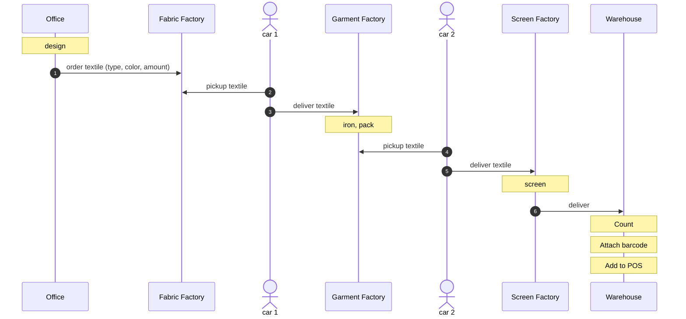

# Urthe Manufacturing Flow

```mermaid
sequenceDiagram
    participant Office
    participant Fabric Factory
    actor car 1
    participant Garment Factory
    actor car 2
    participant Screen Factory
    participant Warehouse

    autonumber

    Note over Office: design
    Office->>Fabric Factory: order textile (type, color, amount)
    car 1->>Fabric Factory: pickup textile
    car 1->>Garment Factory: deliver textile
    Note over Garment Factory: iron, pack
    car 2->>Garment Factory: pickup textile
    car 2->>Screen Factory: deliver textile
    Note over Screen Factory: screen
    Screen Factory->>Warehouse: deliver
    Note over Warehouse: Count
    Note over Warehouse: Attach barcode
    Note over Warehouse: Add to POS
```