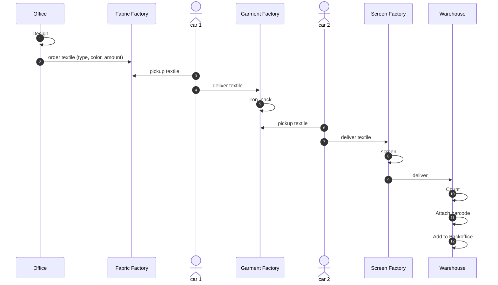

# Urthe Manufacturing Flow

```mermaid
sequenceDiagram
    participant Office
    participant Fabric Factory
    actor car 1
    participant Garment Factory
    actor car 2
    participant Screen Factory
    participant Warehouse

    autonumber

    Office->>Office: Design
    Office->>Fabric Factory: order textile (type, color, amount)
    car 1->>Fabric Factory: pickup textile
    car 1->>Garment Factory: deliver textile
    Garment Factory->>Garment Factory: iron, pack
    car 2->>Garment Factory: pickup textile
    car 2->>Screen Factory: deliver textile
    Screen Factory->>Screen Factory: screen
    Screen Factory->>Warehouse: deliver
    Warehouse->>Warehouse: Count
    Warehouse->>Warehouse: Attach barcode
    Warehouse->>Warehouse: Add to Backoffice
```
