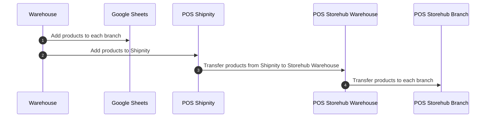
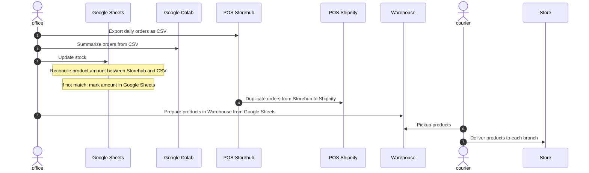

# Urthe Offline Flow

**POS** - Storehub

## Payment channels
- Credit card (min: 500, charge 3%)
- Debit card
- QR Promptpay
- Transfer
- Cash

### Add product

```mermaid
sequenceDiagram
    participant Warehouse
    participant Google Sheets
    participant POS Shipnity
    participant POS Storehub Warehouse
    participant POS Storehub Branch

    autonumber

    Warehouse->>Google Sheets: Add products to each branch
    Warehouse->>POS Shipnity: Add products to Shipnity
    POS Shipnity->>POS Storehub Warehouse: Transfer products from Shipnity to Storehub Warehouse
    POS Storehub Warehouse->>POS Storehub Branch: Transfer products to each branch
```

### End of day

```mermaid
sequenceDiagram
    actor office
    participant Google Sheets
    participant Google Colab
    participant POS Storehub
    participant POS Shipnity
    participant Warehouse
    actor courier
    participant Store

    autonumber

    office->>POS Storehub: Export daily orders as CSV
    office->>Google Colab: Summarize orders from CSV
    office->>Google Sheets: Update stock
    Note over Google Sheets: Reconcile product amount between Storehub and CSV
    Note over Google Sheets: if not match: mark amount in Google Sheets
    POS Storehub->>POS Shipnity: Duplicate orders from Storehub to Shipnity
    office->>Warehouse: Prepare products in Warehouse from Google Sheets
    courier->>Warehouse: Pickup products
    courier->>Store: Deliver products to each branch
```