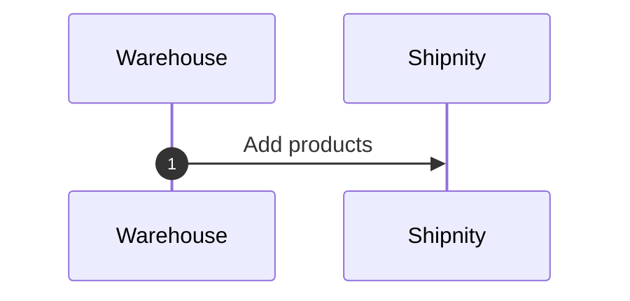
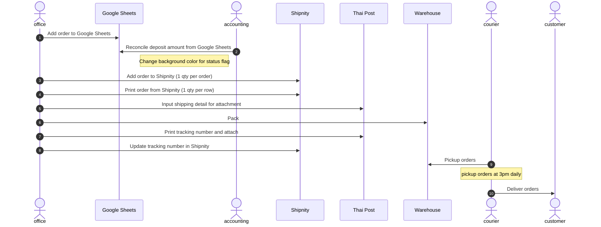
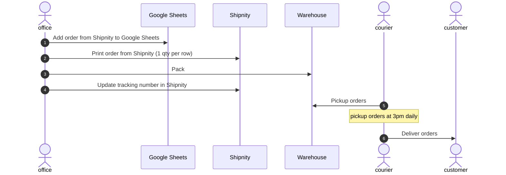

# Urthe Online Flow

**Line, Facebook, Instagram** - ~50 orders/day
**Shopee** - ~200 orders daily
**Lazada** - ~20-30 orders daily

## Add product

## Line, Facebook, Instagram

### Create order process

## Shopee, Lazada

### Create order process

