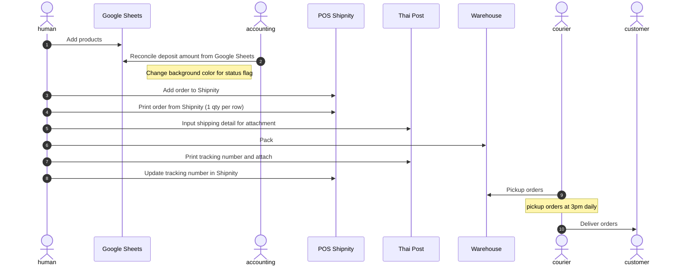
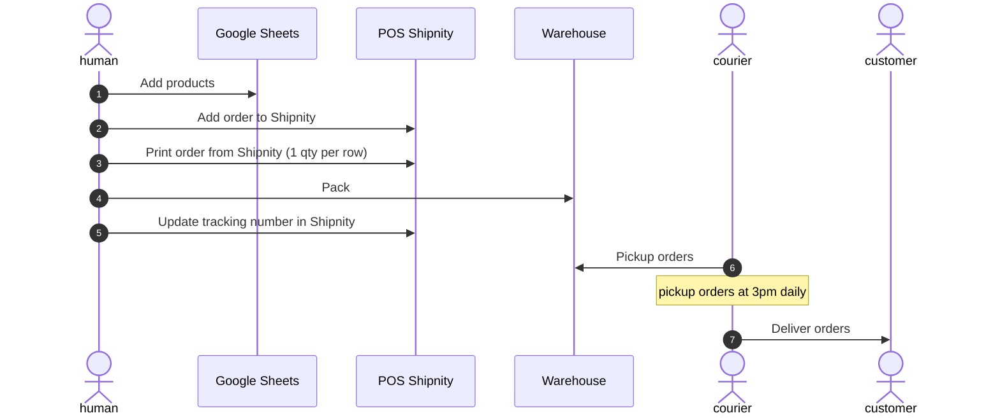

# Urthe Online Flow

**Line, Facebook, Instagram** - ~50 orders/day
**Shopee** - ~200 orders daily
**Lazada** - ~20-30 orders daily

## Line, Facebook, Instagram

```mermaid
sequenceDiagram
    actor human
    participant Google Sheets
    actor accounting
    participant POS Shipnity
    participant Thai Post
    participant Warehouse
    actor courier
    actor customer

    autonumber

    human->>Google Sheets: Add products
    accounting->>Google Sheets: Reconcile deposit amount from Google Sheets
    Note left of accounting: Change background color for status flag
    human->>POS Shipnity: Add order to Shipnity
    human->>POS Shipnity: Print order from Shipnity (1 qty per row)
    human->>Thai Post: Input shipping detail for attachment
    human->>Warehouse: Pack
    human->>Thai Post: Print tracking number and attach
    human->>POS Shipnity: Update tracking number in Shipnity
    courier->>Warehouse: Pickup orders
    Note over courier: pickup orders at 3pm daily
    courier->>customer: Deliver orders
```

## Shopee, Lazada

```mermaid
sequenceDiagram
    actor human
    participant Google Sheets
    participant POS Shipnity
    participant Warehouse
    actor courier
    actor customer

    autonumber

    human->>Google Sheets: Add products
    human->>POS Shipnity: Add order to Shipnity
    human->>POS Shipnity: Print order from Shipnity (1 qty per row)
    human->>Warehouse: Pack
    human->>POS Shipnity: Update tracking number in Shipnity
    courier->>Warehouse: Pickup orders
    Note over courier: pickup orders at 3pm daily
    courier->>customer: Deliver orders
```