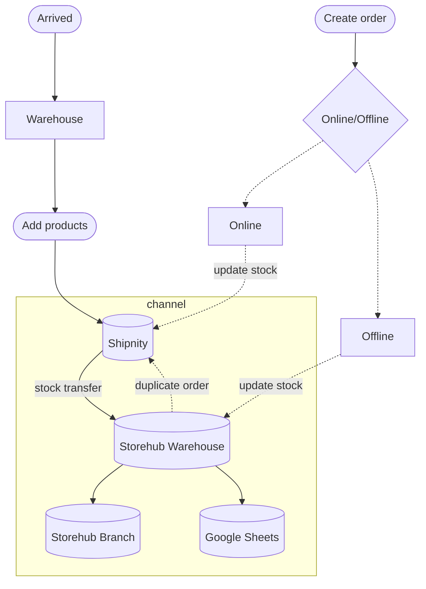

# Urthe Stock Flow

```mermaid
flowchart TD
    Arrived([Arrived]) --> Warehouse
    Warehouse --> AddProduct([Add products])
    AddProduct --> Shipnity[(Shipnity)]
    
    subgraph channel
        Shipnity[(Shipnity)]-- stock transfer --> StorehubWarehouse
        StorehubWarehouse[(Storehub Warehouse)] --> StorehubBranch[(Storehub Branch)] & GoogleSheets[(Google Sheets)]
    end

    CreateOrder([Create order]) 
    CreateOrder --> Channels{Online/Offline}
    Channels .-> Online & Offline
    Online-. update stock .-> Shipnity
    Offline-. update stock .-> StorehubWarehouse
    StorehubWarehouse-. duplicate order .->Shipnity
```