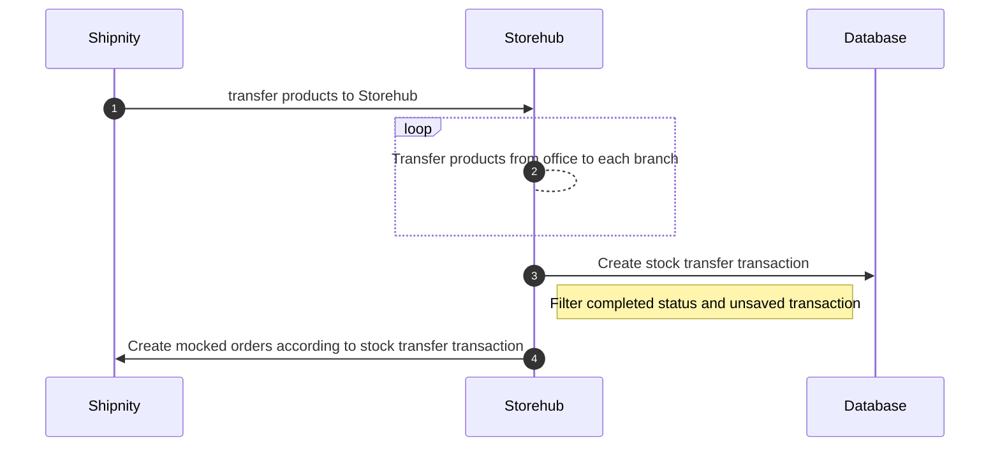

# Stock Transfer Flow

## Improvement

- Improve efficiency for stock team
    - We have 19 branches now and can save x hours/day from stock team for creating mocked orders in Shipnity task.
    - Reduce human error from importing mocked orders in Shipnity.