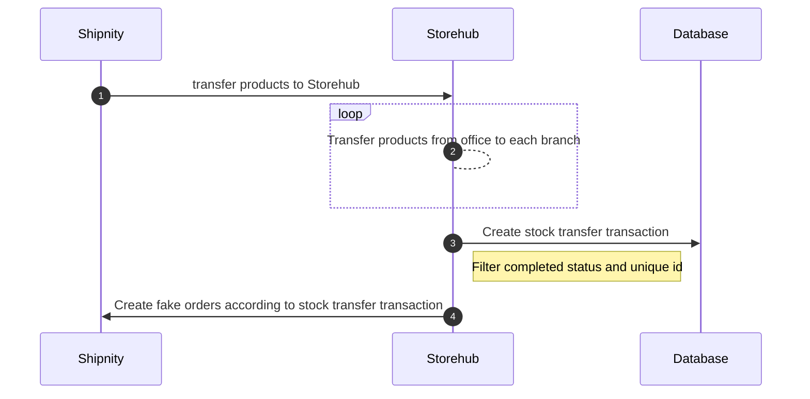

# Stock Transfer Flow

```mermaid
sequenceDiagram
    participant Shipnity
    participant Storehub
    participant Database

    autonumber

    Shipnity ->> Storehub: transfer products to Storehub
    loop
        Storehub-->Storehub: Transfer products from office to each branch
    end
    Storehub ->> Database: Create stock transfer transaction
    Note left of Database: Filter completed status and unique id
    Storehub ->> Shipnity: Create fake orders according to stock transfer transaction
```